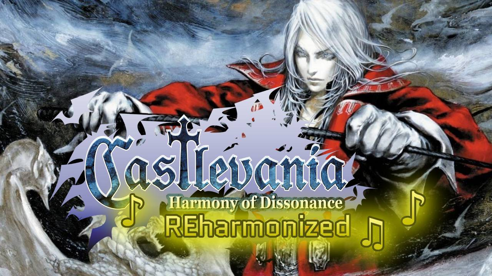

# Castlevania: Harmony of Dissonance - REharmonized (Patch)

Harmony of Dissonance features excellent musical compositions, but its sound engine doesn't do them justice. REharmonized aims to fix that.

Using techniques developed by the romhacking community, this patch brings high-quality community arrangements of the original soundtrack into the game, taking advantage of Aria of Sorrow's improved sound.

[Demo.](https://youtu.be/MyGVkGNWQx0)



## How to use

Get a Castlevania: Harmony of Dissonance ROM (Europe).

```
Database match: Castlevania - Harmony of Dissonance (Europe)
Database: No-Intro: Game Boy Advance (v. 20210227-023848)
File/ROM SHA-1: 58034ADF2CF788ED308286090987CA73F807A54F
File/ROM CRC32: 521B3091
```

[Download REharmonized patch](./REharmonized.bps). 

Apply the patch with a [patching tool](https://www.marcrobledo.com/RomPatcher.js/).

### Add Visual Improvement
[Download Visual Improvement patch](https://www.romhacking.net/hacks/9086/) by Pemburu Vampir. 

- STEP 1: Apply REharmonized patch first.
- STEP 2: Apply "Visual Improvement" (Pemburu Vampir) to the result of STEP 1.

- Applying REharmonized first allows other patches to be applied afterwards, but sometimes it won't work 100%. **I'll keep an eye on community feedback.**

## Patch changes
- Most of Harmony of Dissonance's songs have been replaced with higher-quality versions based on covers made by the community (see Credits).

- A GBA ROM can only hold 32MB, so a handful of original compositions were kept untouched to save space. If memory management improves in the future, some of these songs may eventually be replaced too. The choice of which songs to keep was based on how much they affect the core gameplay experience. The songs that have NOT been modified are:
  01. title screen part 1
  02. title screen part 2
  19. game over
  24. pitch-dark door
  26. VK2K2 - Vampire Killer 2002
  27. game over Simon

- In the original game, pausing mutes the music. Due to technical limitations, the music has been kept playing while the game is paused.


## Developer notes

[Developer notes (Spanish)](./dev_es.md)

[Developer notes (English)](./dev_en.md)

## Music list / ROM replacements
| ID | Song | Author |
|----|------|--------|
| 01 | ~~title screen part 1~~ | ~~Erik Hose~~ |
| 02 | ~~title screen part 2~~ | ~~Erik Hose~~ |
| 03 | name entry | The Noble Demon |
| 04 | prologue (Maxim Kischine's theme, variation) | Tobbeh99 Music |
| 05 | successor of fate (Juste Belmont's theme) | Jorge Fuentes |
| 06 | offense and defense - marble corridor | Jorge Fuentes |
| 07 | approach to despair - shrine of the apostates | Jorge Fuentes |
| 08 | luminous caverns | Jorge Fuentes |
| 09 | skeleton den - cave of skeletons | Jorge Fuentes |
| 10 | chapel of dissonance | Jorge Fuentes |
| 11 | clock tower casualty | Jorge Fuentes |
| 12 | aqueduct of dragons | Jorge Fuentes |
| 13 | to the center of the demonic castle - castle treasure | Jorge Fuentes |
| 14 | dark covenant (Death's theme) | Jorge Fuentes |
| 15 | desicive battle (loop pattern A) | Good Knight Productions |
| 16 | desicive battle (loop pattern B) | Good Knight Productions |
| 17 | desicive battle (loop pattern C) | Good Knight Productions |
| 18 | epilogue 1 | TheWanderingNight |
| 19 | ~~game over~~ | - |
| 20 | incarnation of darkness (Dracula's theme) | Erik Hose |
| 21 | old enemy | Dracula9AntiChapel |
| 22 | beloved person (Lydie Erlanger's theme) | Jorge Fuentes |
| 23 | successor of fate (Juste Belmont's theme) - variation | TristanMachinima |
| 24 | ~~pitch-dark door~~ | - |
| 25 | knight head | Francisco Relaño Peña |
| 26 | ~~VK2K2 - Vampire Killer 2002~~ | ~~Jorge Fuentes~~ |
| 27 | ~~game over Simon~~ | - |
| 28 | I'll sell at my place (Mechant's theme) | WSPursuer |
| 29 | Maxim Kischine's theme | Jorge Fuentes |
| 30 | epilogue 2 (Lydie Erlanger's theme, variation) | TheWanderingNight |
| 31 | the item collection room | Nostalgames_XP (Forro tribute) |

## Credits
AlexArroyoDuque

### Using Streamed Audio in Castlevania: Aria of Sorrow
Rexius55 https://www.romhacking.net/documents/927
This guide has helped me create music versions that sound like they’re from Aria of Sorrow, and then I ported them over to Harmony of Dissonance.

### Visual improvement
[Pemburu Vampir](https://www.romhacking.net/hacks/9086/)

### Remastered songs
Jorge Fuentes
https://youtube.com/playlist?list=PLCBFCB11FD122D30C&si=r5ZHh25cNPkeDnD1

The Noble Demon
https://youtu.be/b26E9TJZ9EU?si=96WFSdW4wUscnhyy

Tobbeh99 Music
https://youtu.be/Pibo2miNLyw?si=cDKW8jx8cDRN9EXl

Erik Hose
https://youtu.be/gMZP08rAFOg?si=j3cbffkrVL_Guqok

Dracula9AntiChapel
https://youtu.be/iPJRqpGrLeg?si=6ouZC0z5lgLtoHmE

Francisco Relaño Peña
https://youtu.be/Sht2rVI7F_w?si=PN12uiUF2yt1S9La

TheWanderingNight
https://youtu.be/taMAxjqEt4o?si=6ibJ9sYgcs9N1Al-

Nostalgames_XP
https://youtu.be/ywoTWwMBl_M?si=HCAmEwI0YPzwFUEr&t=3874

https://youtu.be/LVbmQXmpP8c?si=lJXYdGTGUCFtw2GP

WSPursuer
https://youtu.be/gi74xmfdlcs?si=mFowT4Pje0LHyO8e

TristanMachinima
https://youtu.be/RrCIrBIs90Y?si=CMK_Xs0LNy22pHc1

Good Knight Productions
https://youtu.be/jVrqvykS5HY?si=VNCFAH1rqFuW0lt2